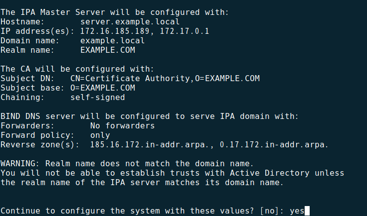
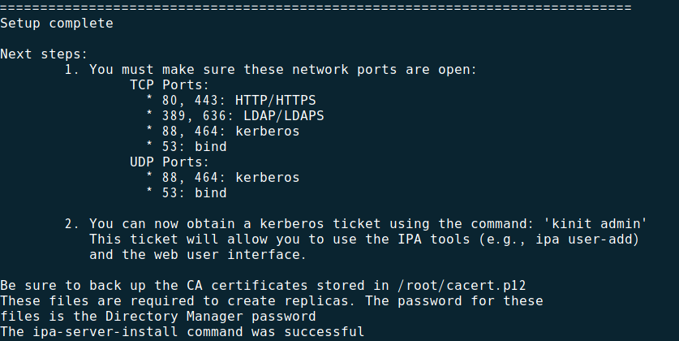

## KIM部署

### 一、环境准备

1. 网络设置
    配置服务器IP、网关等

2. 主机名设置
   
    系统安装时可以设置主机名，或者安装后使用命令修改，要求主机名为FQDN形式，如```server.kimserver.local```
   
   > 确定主机名之前请务必ping一下，确保不会与其他域名冲突
   
    命令修改方式为
   
   ```sh
   # 例如 hostnamectl set-hostname server.kimserver.local
   hostnamectl set-hostname <hostname>
   ```
   
   > v10版本的hostnamectl命令修改主机名时不会修改/etc/hostname文件，所以重启后会恢复原来的主机名，可以手动修改/etc/hostname文件并重启

3. 防火墙设置
   
    在 ```开始菜单``` --> ```防火墙``` 打开防火墙
    在 ```区域``` --> ```服务``` 勾选以下几项：
   
   - [x] ```dns```
   
   - [x] ```http```
   
   - [x] ```https```
   
   - [x] ```kerberos```
   
   - [x] ```kpasswd```
   
   - [x] ```ldap```
   
   - [x] ```ldaps```
   
   - [x] ```ssh```
   
   - [x] ```ntp```
     
     然后在 ```区域``` --> ```端口``` 新增 ```tcp``` 协议的 ```7878``` 、```1812 ```、```9468``` 、```123```、```6080-6089```、```5911-5920```端口
     在选项点击 ```将Runtime设定为永久配置```
     

4. 本地源配置
   
    这里需要两个文件，```local_kim.repo``` 和 ```kimpkg-*.tar.gz```
   
    将 ```local_kim.repo``` 文件放到 ```/etc/yum.repos.d/``` 路径下
   
    将 ```/etc/yum.repo.d/``` 路径下其他文件中软件源配置的 ```enable``` 改为0，安装结束后再还原
   
    将 ```kimpkg-*.tar.gz``` 解压，得到 ```pkgs``` 文件夹，把 ```pkgs``` 文件夹放到 ```/var/``` 路径下
   
   > 注 如果架构为arm64, 需将 ```docker-compose/``` 中的包也放入/var/pkgs/下
   
    执行
   
   ```sh
   createrepo /var/pkgs
   
   dnf makecache
   ```
   
    本地源配置完毕

### 二、安装

1. KIM安装
   
    直接使用 ```dnf``` 命令安装
   
   ```sh
   dnf install kim-server-dns --allowerasing
   ```
   
    安装可以安装配置kim，安装前请检查umask是否为0022
    执行
   
   ```sh
   umask -S 
   # 若返回:u=rwx,g=rx,o=rx,表明umask为0022
   ```
   
    如果不为0022，安装前在终端临时设置为0022:
   
   ```sh
   umask 0022
   
   ipa-server-install --hostname=server.example.local \ 
                      --domain=example.local \
                      --realm=EXAMPLE.LOCAL \
                      --ip-address=IP_ADDRESS \
                      --setup-dns \
                      --auto-reverse \
                      --allow-zone-overlap \
                      --no-forwarders \
                      --no-ntp
   ```
   
   > 将参数中主机名和域名替换为实际的主机名与域名，realm参数注意大写，IP_ADDRESS填写实际网卡的IP地址
   > 然后根据提示设置Directory Manager密码和管理员admin密码后确认安装，请务必记住这两个密码。

    如果清楚安装流程，也可以不带任何参数安装，通过后面的提示配置参数

    

    安装过程其它参数酌情配置。

    安装需要几分钟时间，等到安装成功后，会出现以下提示：
    

    设置自动创建家目录：

    ```sh
    authconfig --enablemkhomedir --update
    ```

    在浏览器访问https://server.example.local地址，可以进入到KIM管理界面，第一次使用的时候用admin账户和安装时配置的密码登录。
    如果希望采用非交互式安装，可以使用如下命令

    ```sh
    ipa-server-install --hostname=server.example.local \
                    --domain=example.local \
                    --realm=EXAMPLE.LOCAL \
                    --ip-address=IP_ADDRESS \
                    --setup-dns \
                    --auto-reverse \
                    --allow-zone-overlap \
                    --no-forwarders \
                    --no-ntp \
                    --ds-password=DM_PASSWORD \
                    --admin-password=ADMIN_PASSWORD \
                    --unattended \
                    --quiet
    ```

    > DM_PASSWORD为ldap管理员密码，ADMIN_PASSWORD为系统管理员密码。不建议在终端直接采用该方式安装

### 三、说明

这里的本地源解压后包括kim安装包和依赖，解压出来的pkgs文件夹下均为依赖，```pkgs/kim/``` 文件夹下则是我们制作的kim和策略管控相关包，如果后面有升级包中只有kim包，可以将升级包替换 ```pkg/kim``` 文件夹下的旧包，然后执行

```sh
createrepo --update /var/pkgs

dnf makecache
```

完成本地源的包更换

卸载KIM，执行

```sh
ipa-server-install --uninstall
```

升级KIM，执行

```sh
ipa-server-upgrade
```

### 四、备注

默认模式不再需要校验设备信息，即加域前无需导入资产表格，暂不开放普通用户加域权限，所以该模式下加域验证需使用admin或者具有主机管理员角色的用户。

开启校验设备信息模式方法，服务端执行：

```sh
kinit admin

ipa config-mod --addattr="ipaConfigString=DeviceVerify"
```

关闭校验：

```sh
ipa config-mod --delattr="ipaConfigString=DeviceVerify"
```

开启新用户无需修改密码

```sh
kinit admin

ipa config-mod --addattr="ipacustomfields=NOPWDEXP"
```

关闭新用户无需修改密码

```sh
ipa config-mod --delattr="ipacustomfields=NOPWDEXP"
```